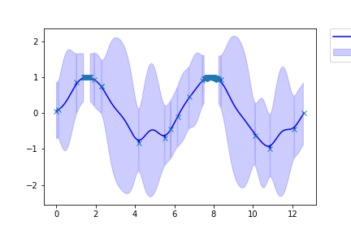
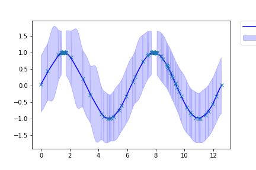

# Bayesian_optimization_scratch_implementation

Implement Bayesian optimization with numpy and random only

The following graph is the graph of Gaussian Process Regression Last Performed in Bayesian Optimization

The left side is β=2 
The right side is β=100

  

β indicates the hyperparameter of the acquisition function, and the search becomes more important as β increases.
